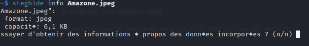
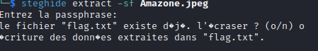

#  Amazone:
```
Level: Basic, 50pts 
```

# Description: 
```
Let me talk !
Flag : CTF_*
```

>For this challenge, we are given an image file amazon.jpeg 
We used the steghide tool 

`$ steghide info Amazone.jpeg`




>steghide shows us the presence of a hidden file in the image. However we do not know the passphrase 
So we tried strings on the file but nothing. We also used stegsolve (we tried to play with constrates, colors ,etc..)  to see if the passphrase would not be hidden in the image but still nothing. 

>We decided to brute force with stegseek using the rockyou dictionary but nothing either. At this level we tried all the dictionaries. That we could find but nothing :angry:
We have also tried other methods that we will not mention and that did not work. Considering that the challenge is rated at 50 pts it shouldn't be a big thing  .

```
Let's make a guess.
``` 

>we tried as passphrase: amazon , Amazone, AMAZONE, letmetalk, LetMeTalk , Letmetalk, etc. Finally we found the right passphrase  :joy: : **4m4z0n3**

`$ steghide extract -sf Amazone.jpeg`





>La description du challenge devrait etre leet et non let me talk. 

```
Flag: ``` **CTF_ST3Gh1d3934U9432135**
