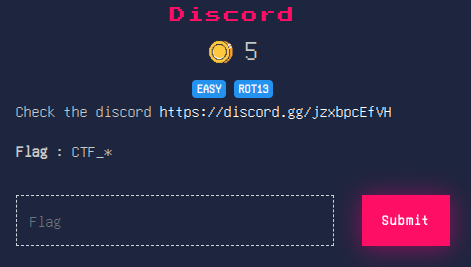
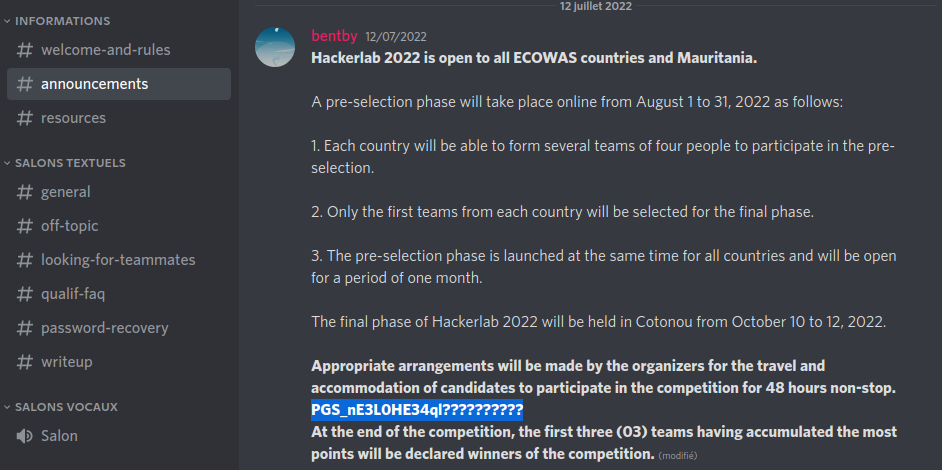
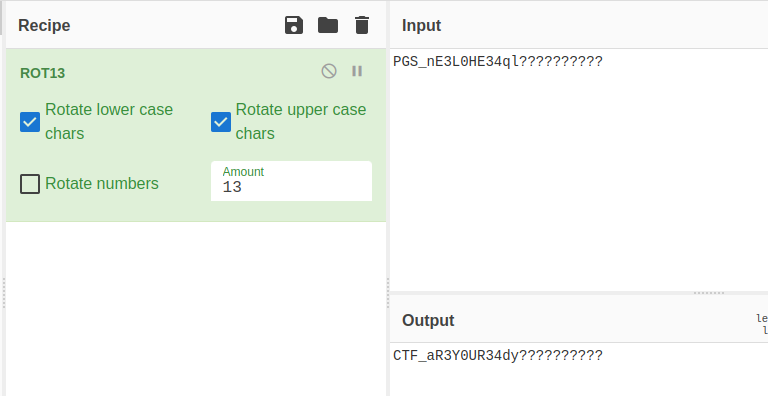

#  Discord
```
Level: Basic, 5pts 
```
# Description: 



>For this challenge we have a link that leads us to the Discord channel of the competition.
When we look at the level of "announcements" we have a message that draws our attention.



>By decoding the content of the message with rot13 we get our flag.



>```Flag :``` **CTF_aR3Y0UR34dy??????????**
