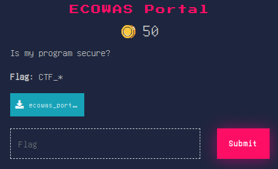
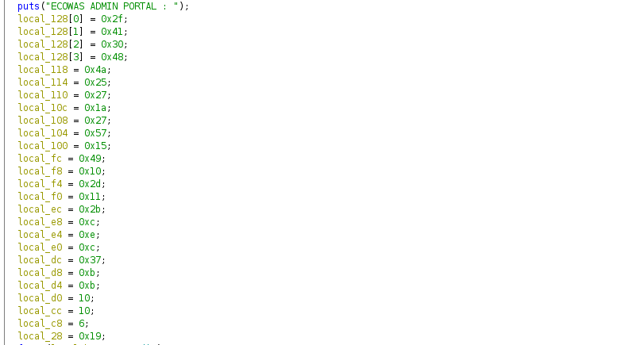
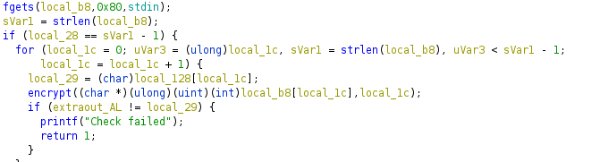
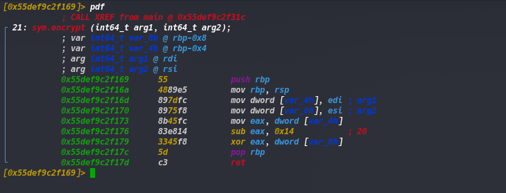
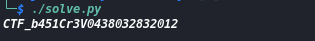

#  Ecowas Portal

```
Level: Basic, 50pts 
```

# Description: 



>This challenge it is a reverse engineering, we will start by observing the code with Ghidra.



>We find several variables in the main which seems to be our flag.When we go through the code a little we notice that the flag is 25 characters which corresponds to the number of variables that we had previously seen. We must then determine which method was used to encrypt the contents of these variables.



>We then come across the encrypt function which seems to be the encryption method to use.
>By reading the contents of the function we can see that the function receives two parameters, one which corresponds to a character of the flag and another which corresponds to the index of the character. Then we notice that the function subtracts 0x14 (20) from our first parameter then it makes an xor of the result with the index of this character which corresponds to the second parameter. 



>Once we understood that, we just had to write a python code to do the opposite of the function.


```python
#!/usr/bin/python3

a=[0x2f,0x41,0x30,0x48,0x4a,0x25,0x27,0x1a,0x27,0x57,0x15,0x49,0x10,0x2d,0x11,0x2b,0xc,0xe,0xc,0x37,0xb,0xb,0xa,0xa,0x6]
c=[]
for i in range(25):
    b=a[i] ^ i
    b+=20
    c.append(chr(b))

print(''.join(c))

```

>When we execute the script we get our flag



>```Flag :``` **CTF_b451Cr3V0438032832012**
