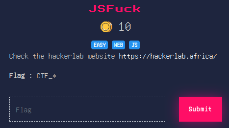
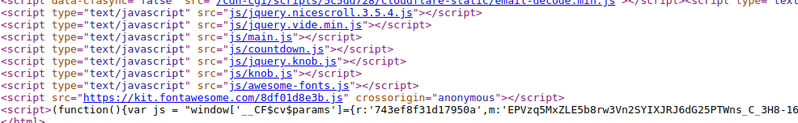
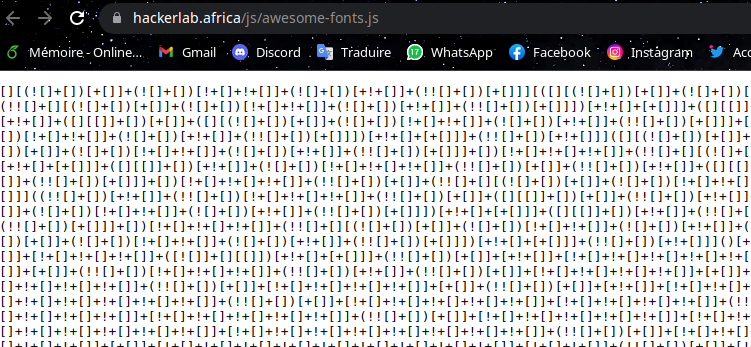
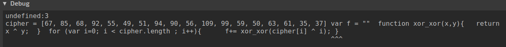
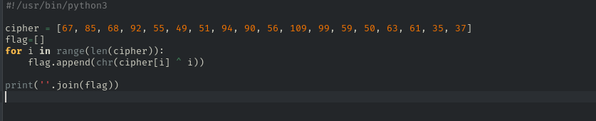
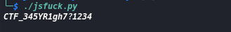

# JS Fuck
```
Level: Basic, 10pts 
```

# DESCRIPTION:



>This challenge gives us a link to the competition webpage. Referring to the name of the challenge, we decided to look for the js files that are on the website by looking in the source code.



>Looking at the content of js files we come across something interesting in the awesome-fonts.js file. It's js fuck(**JSFuck is an esoteric and educational programming style based on the atomic parts of JavaScript. It uses only six different characters to write and execute code.**)



>We then use the site **https://tio.run/#javascript-node** to decode the content.



>Once we have decoded it does not take long to understand that each character of element is ciphered and xored with the corresponding index. We then write a code in python to obtain the flag.



>By executing our code we get the flag



>```Flag :``` **CTF_345YR1gh7?1234**
