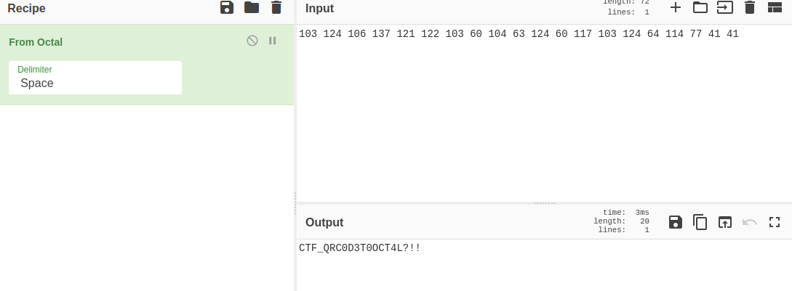

# Secret pdf :

```
Level: Easy, 20pts 
```

# Description: 
```
Can you open it?
Flag : CTF_*
```

>For this challenge we were given a password protected pdf file 
We used pdf2john  and john 

`$ pdf2john secret.pdf > hash.txt`

`$ john hash.txt`

`$ john hash.txt --show`
```
secret.pdf:MyP@ssw0rd!

1 password hash cracked, 0 left
                                  
```

password is **MyP@ssw0rd!**

>We open the pdf file. By doing a Ctrl + A you can see these characters 103 124 106 137 121 122 103 60 104 63 124 60 117 103 124 64 114 77 41 41
the code is in octal we decode it on cyberchef 



```Flag:```  **CTF_QRC0D3T0OCT4L?!!**  
