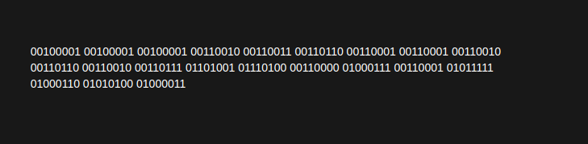
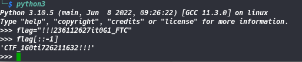

#  Youtube

```
Level: Basic, 5pts 
```
#  Description


>The name of this challenge reminds us of the announcement that had been made on YouTube designing the competition. So we go to the video link to try to see if there is additional information. Looking in the description of the video you come across a series of binary number.



>When we decorate the binary we remind that our flag is written in the opposite direction. So we use Python to put it back in



```Flag :``` **CTF_1G0ti726211632!!!**
